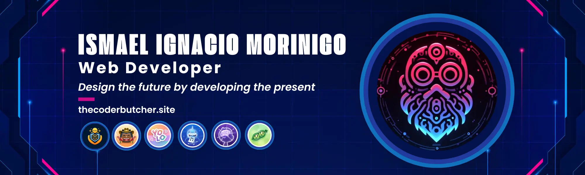

    <a href="https://thecoderbutcher.site" target="_blank"></s>
        
    </a> 

### I'm a constantly growing 🌐 web developer, passionate about 🎨 graphic design, 🍕 pizza lover and an 📚 information systems engineer in process 

- :computer: I’m currently working on my own projects
- 📚 I’m currently learning JavaScript full stack (React, NextJs, NodeJs, TypeScript)
- :eyes: I’m looking to collaborate on Js project to complete my learning
- 👨‍💻 I created Mirai Dev for the development of modern web applications using the best technologies, agile methodologies and latest generation tools.

    

